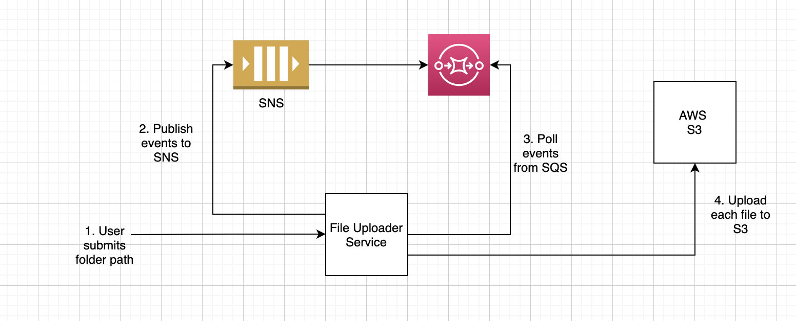

## Part 1

This project is part of the practice sessions for akka streams.

## Part 2

This repo contains a mini project that user akka streams library alpakka to upload file to S3.

### Motivation

Generally, when uploading hundreds of small files to S3, if there is any error while uploading to S3, then the whole process stops and there is no track of
 how many files have been uploaded and the whole process needs to be started again. Although, S3 detects internally which files have been uploaded, 
 still the user needs to drag and drop all the files again. This project mainly tries to solve this problem by sending file metadata as events to SNS-SQS and 
 then polling events from SQS and streaming files to S3.
 

### Tech Debt

The project is in its very early stages and a lot more is to be done. Few of the things that have highest priority are :

#### Functional Requirements
1. Recursively send events for folders inside a folder.
2. Different handling mechanism for large videos and large files 

#### Non Functional Requirements
1. Introduce logging mechanism
2. Introduce database to keep track of files uploaded
3. Introduce dead letter queues